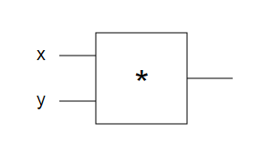

# Hacker's guide to Neural Networks

[原文地址](http://karpathy.github.io/neuralnets/)

&emsp;&emsp;大家好，我是斯坦福大学的计算机博士生。作为研究的一部分，我已经在机器学习方面从事了一些年，与其中的几个项目相关的是ConvNetJS(一个神经网络的Javascript库)。Javascript可以很好的将正在发生的呈现出来并且，也可以很好的和各种超参数设置打交道,但是我仍然经常听到一些人要求对于这个话题有一个更彻底的对待。这篇文章(我计划通过一些章节，慢慢扩充篇幅)是我谦卑的尝试。这些文章是基于网络的而不是PDF，因为所有的书就该这样，最终希望包含动画，例子等等。

&emsp;&emsp;我个人的关于神经网络的经验是，当我开始忽略整页的密集的反向传播等式原理，开始写代码时，所有的事情都清晰了很多。因此，这篇教程将包含很少的数学内容(我认为它是没有必要的并且它有时候甚至会使一些简单的概念变模糊)。尽管的我的背景是计算机科学和物理学，但我会从作为hackers的视角来开展这个话题。我的阐述将以代码和本质的知识为中心而不是数学的原理。基本的，我将尽量以这种方式在呈现算法，就是我希望当我开始时，这些算法是我之前已经接触过的。

    “…everything became much clearer when I started writing code.”
&emsp;&emsp;你可能急着想跳过这里，去学习如何在实践中把习神经网络，反向传播应用到数据集。但是在开始之前，我希望我们先忘掉那些。让我先后退一步，理解我们要做的核心是什么。首先我们来讨论real-valued circuits.

&emsp;&emsp;更新说明：我之前暂停了本指南的工作，并将很多精力重新引向斯坦福大学CS231n（卷积神经网络）课堂。 笔记在[cs231.github.io](http://cs231n.github.io/)上，课程幻灯片可以在[这里](http://cs231n.stanford.edu/syllabus.html)找到。 These materials are highly related to material here, but more comprehensive and sometimes more polished.

# Chapter 1: Real-valued Circuits
&emsp;&emsp;我个人认为，real-valued circuits是理解神经网络最好的方式，实值沿着边"流动"，在逻辑门交互。但是，不像逻辑门中的and or not那样，我们使用二进制门。比如*(乘),+(加),最大值或者一元门exp等等。不像典型的布尔电路，尽管在我们这个电路中，最终也将在电路的相同边缘上梯度流动，但反方向可以相反。但是现在说这些说的有些超前，我们先来看一个简单例子。

## Base Case: Single Gate in the Circuit

